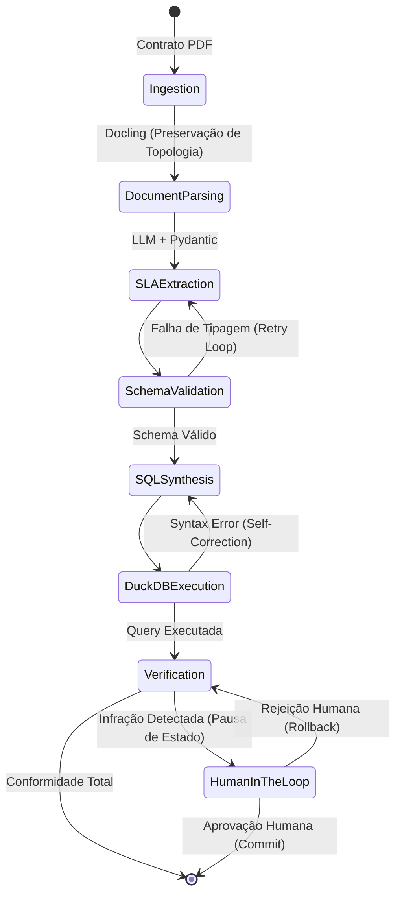

# System Architecture & Engineering Design

[🇺S English](#english) | [🇧🇷 Português](#português)

---

## 🇧🇷 Português: Arquitetura e Decisões de Design

### 1. Filosofia de Engenharia: Determinismo sobre Probabilidade
A maior falha em sistemas de IA Enterprise é tratar LLMs como "oráculos". Nesta arquitetura, o LLM é apenas um "motor de tradução" (Texto -> Schema -> SQL). A lógica de negócios, o cálculo da multa e a decisão final são estritamente **determinísticos**, executados via código Python e SQL. O LLM não calcula a multa; ele extrai a fórmula para que o motor analítico a execute.

### 2. O Grafo de Resiliência (LangGraph State Machine)
O fluxo não é um pipeline "fire-and-forget". É uma Máquina de Estados Finita (FSM) com nós de auto-correção (*Self-Correction Loops*).

### 3. Componentes Core e Trade-offs
#### A. Ingestão e Contexto: Por que Docling em vez de PyPDF/Tesseract?
O Problema: Ferramentas OCR padrão leem da esquerda para a direita, misturando colunas de tabelas de SLA e destruindo o contexto jurídico.

A Solução: Docling (IBM) realiza Layout Analysis usando Modelos de Visão. Ele compreende que uma "Multa de 5%" pertence à célula da "Janela de 4 horas", entregando um Markdown semanticamente perfeito para o LLM não se perder.

#### B. Execução Analítica: DuckDB In-Memory vs Cloud Data Warehouses
O Problema: Enviar 10 milhões de linhas de log (telemetria) para o LLM analisar estoura o limite de contexto (Context Window) e é financeiramente inviável.

A Solução: O LLM atua como um engenheiro de dados, escrevendo a query SQL. O DuckDB integrado executa essa query contra arquivos Parquet/CSV localmente na memória RAM. Custo de nuvem: zero. Latência: milissegundos.

### 4. Escalabilidade: Lidando com Contratos de +500 Páginas
Para evitar estourar o limite de tokens do LLM com contratos gigantes, o sistema não usa o clássico Semantic Chunking (que quebra frases ao meio).

#### Structural Sharding
O sistema divide o documento com base em cabeçalhos Markdown (## Cláusula 4). Apenas as seções classificadas previamente como "Relevantes para SLA" são enviadas para a etapa de extração profunda.

### 5. Segurança B2B e Privacidade de Dados
Contratos empresariais contêm dados sensíveis (PII, valores de negociação).

LLM Routing: A arquitetura prevê roteamento dinâmico. Partes públicas ou anonimizadas podem ir para APIs rápidas (Groq/Llama3). Trechos com alta sensibilidade são processados 100% localmente usando Ollama, garantindo Zero-Data Retention por terceiros.

### 6. Observabilidade e Tracing (O "Caixa Preta" Resolvido)
Sistemas multi-agentes falham de forma silenciosa. Para auditar a própria IA:

Instrumentação completa utilizando LangSmith (ou Logfire). Cada chamada de ferramenta, retry de extração e erro de SQL é rastreado. É possível ver exatamente qual prompt gerou uma SQL com erro e quanto tempo o DuckDB levou para corrigir.

## 🇺S English: Architecture & Design Decisions
### 1. Engineering Philosophy: Determinism over Probability
The biggest flaw in Enterprise AI systems is treating LLMs as "oracles". In this architecture, the LLM is merely a "translation engine" (Text -> Schema -> SQL). Business logic, penalty calculation, and final decisions are strictly deterministic, executed via Python and SQL. The LLM does not compute the penalty; it extracts the formula for the analytical engine to execute.

### 2. Resilience Graph (LangGraph State Machine)
The flow is not a "fire-and-forget" pipeline. It is a Finite State Machine (FSM) featuring Self-Correction Loops.

(See the Mermaid diagram in the Portuguese section for the visual workflow).

### 3. Core Components and Trade-offs
#### A. Ingestion and Context: Why Docling over PyPDF/Tesseract?
The Problem: Standard OCR tools read left-to-right, scrambling SLA table columns and destroying legal context.

The Solution: Docling (IBM) performs Layout Analysis using Vision Models. It understands that a "5% Penalty" belongs to the "4-Hour Window" cell, delivering a semantically perfect Markdown so the LLM doesn't hallucinate.

#### B. Analytical Execution: DuckDB In-Memory vs Cloud Data Warehouses
The Problem: Sending 10 million rows of telemetry logs to an LLM for analysis blows up the Context Window and is financially unviable.

The Solution: The LLM acts as a data engineer, writing the SQL query. The embedded DuckDB executes this query against Parquet/CSV files locally in RAM. Cloud cost: zero. Latency: milliseconds.

### 4. Scalability: Handling 500+ Page Contracts
To avoid hitting LLM token limits with massive contracts, the system avoids classic Semantic Chunking (which breaks sentences in half).

#### Structural Sharding
The system partitions the document based on Markdown headers (## Clause 4). Only sections pre-classified as "SLA-Relevant" are forwarded to the deep extraction node.

### 5. B2B Security and Data Privacy
Enterprise contracts contain sensitive data (PII, negotiation values).

LLM Routing: The architecture supports dynamic routing. Public or anonymized sections can be routed to fast APIs (Groq/Llama3). Highly sensitive segments are processed 100% locally using Ollama, ensuring Zero-Data Retention by third parties.

### 6. Observability and Tracing (Solving the "Black Box")
Multi-agent systems often fail silently. To audit the AI itself:

Full instrumentation using LangSmith (or Logfire). Every tool call, extraction retry, and SQL error is traced. We can pinpoint exactly which prompt generated a faulty SQL and how long DuckDB took to correct it.